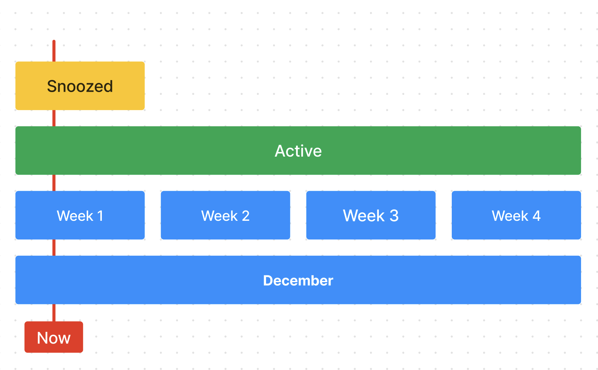
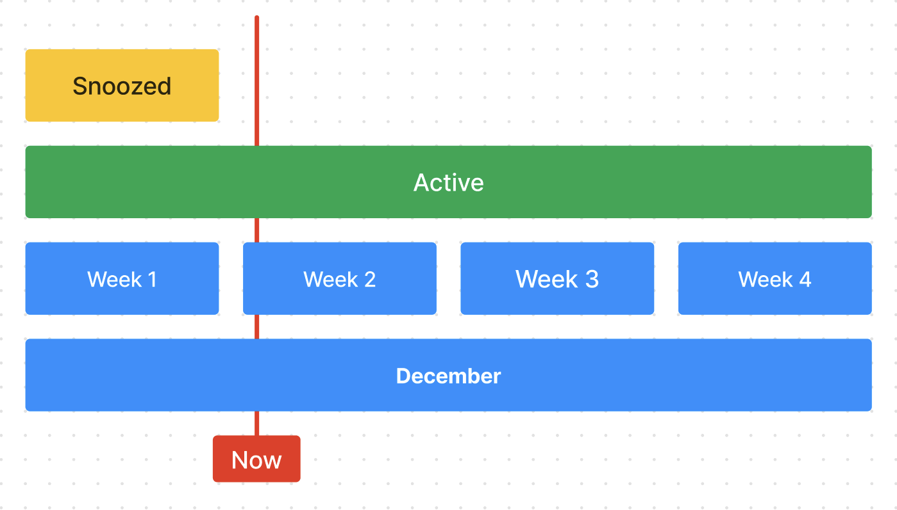
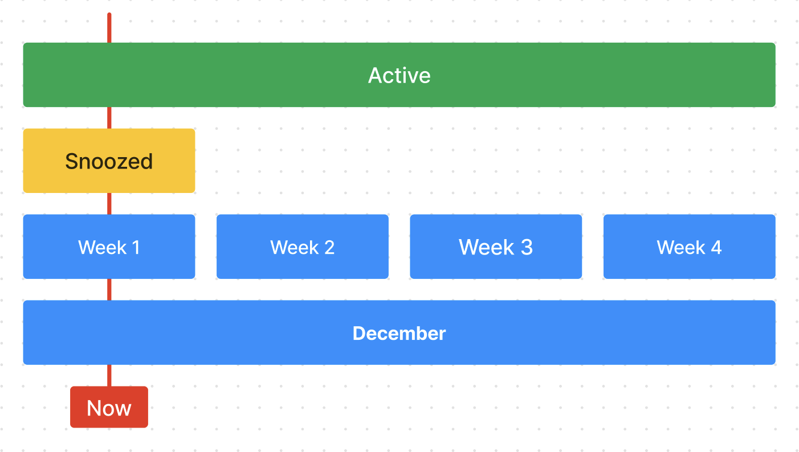

# Glass Goals

Glass Goals is a cross between a to-do list and a journal. The purpose is to maximize the likelihood of achieving your goals and aggregate information about your experiences so that you can continually improve along the dimensions that are important to you.

# How Does It Work?

Here's a personal example about how you can use Glass Goals. I have a goal to become a lawyer.

 - I'll add a goal called "Become a Lawyer"
 - I know that Law School is going to take more than a year so I'll mark this as active long term.
 - Then, as subgoals, I might add:
   - "Get a 175 on the LSAT"
   - "Apply to Law School"
   - "Pass the Bar"
 - For "Get a 175 on the LSAT", let's say I look up the test dates and I decide to take it in 2 months. I can set that Goal as active until that date. When I do that, the goal shows up in the "This Quarter" section.
 - For "Apply to Law School", this is something that I know I need to work towards but maybe I just want to focus on taking the LSAT. So I could set that goal as active for the year and then I can snooze it until after the test. This way, once I'm done with the test, this will just show up as active again.
 - Finally passing the bar isn't something I'm going to worry about until at least I'm in Law School so maybe I decide to snooze that until the start of the first semester.
 - From here, the process becomes at the start of every new time period (the beginning of the day, the beginning of the week, etc) I will review my longer term goals and decide, what things do I want to work on for that time period. For example, at the beginning of the next month, I will spend some time considering my quarterly and yearly goals, to decide what goals I should bring into this month. For example, since "Get a 175 on the LSAT" is one of my quarterly goals, I may decide to come up with a specific goal for this month, e.g. "Take 4 practice tests" or "Improve my accuracy on the Reading Comprehension section".

So that's just a little taste of how you can use Goals and Statuses in Glass Goals to structure a project.

# How Do I Use It?

You can try this out right now by going to glassgoals.com. It's totally free.

# Why Glass Goals?

You might be thinking to yourself, there are a billion project management, task tracker and to do list apps out there. Why not just use one of those? 

The real answer is that Glass Goals started life as an app for Google Glass. The original idea was that I would constantly have a heads up reminder of my active goal. I went on to build a web app companion to the Glass app and got carried away. ¯\\\_(ツ)\_/¯

Along the way I realized there were many ways in which the project management systems that I had used in the past didn't align well with the way my brain works. After working through these problems for a year or so, I've gotten to a point where the system has some interesting properties that I haven't seen elsewhere. I'm sharing it now in case it's useful to others.

# Terminology

## Goal

A goal is anything that you want to achieve. It can be a concrete thing like "Run a Marathon" or an abstract thing like "Be a better person". It can be any scale from "Get out of bed" to "Cure cancer". It can be a one-time thing like "Get a promotion" or an ongoing thing like "Exercise regularly".

## Subgoal

A subgoal is a goal that ostensibly supports the achievement of another goal. Glass Goals allows you to nest Goals arbitrarily deeply. One important part of being effective, is regularly re-evaluating whether subgoals are actually supporting the achievement of their parent goals. In my experience, it can be easy to get caught up in the details of a subgoal and lose sight of the big picture. It's important to regularly ask yourself whether the subgoals you're working on are actually supporting the achievement of your parent goals.

## Supergoal

A supergoal is the counterpart to a subgoal. It is the goal that is supported by it's subgoal. If the goal is "Run a 5k", the Supergoal is "Run a Marathon". 

## Status

At any point in time, Goals have a single status. The status can be one of the following:

 - `Active` - You intend to work on this goal.
 - `Snoozed` - You do not intend to work on this goal.
 - `Done` - This goal does not currently require any work.
 - `Archived` - You don't need this goal anymore and you didn't do anything to achieve it.
 - `To Do` - This goal has no explicit status. It indicates that you have not yet decided what to do with this goal.

One way in which Glass Goals is different than other task tracking systems is that, generally, all statuses that you set on Goals have a start and an end time. In addition, these statuses are additive. Setting a status on a Goal does not remove any other statuses that are already set. For example, let's say you have a Goal that you want to achieve this month, but you don't want to work on it immediately. At the beginning of the month, you can set its status to `Active` for "This Month" and then set its status to `Snoozed` until next week. For that week, the goal will be hidden. At the end of the week, the goal will be considered `Active` again, because the `Snoozed` status has expired.

I think about Statuses as a "stack" of statuses:

 

At first, there are no statuses on the stack. Then, we add the `Active` status for "This Month". That adds the first status to the stack. Next, we add the `Snoozed` status for a week. That adds the second status to the stack. This shadows the first status. At the end of the week, the `Snoozed` status ends and the `Active` status is revealed again: 

It's important to note that the statuses are ordered in the stack according to the order they were added. So if we set the `Snoozed` status first and then set the `Active` status, the `Active` status would be on top of the stack and the `Snoozed` status would be hidden (and therefore useless):

## Time Slice

A Time Slice is a period of time with a start and an end. The Glass Goals app shows your the Active goals in a series of Time Slices. The Time Slices in the app are:

    - Today
    - This Week
    - This Month
    - This Quarter
    - This Year
    - Long Term

Goals are shown in the narrowest time slice which completely contain the most recently set Active status. For example, let's say you set a Goal to `Active` for "This Month" and then set it `Active` for "Today". That Goal will only show up in the "Today" time slice.

## Note Log

Every Goal has a Note Log where you can add thoughts about the goal. In addition to notes on the Goal itself, the notes from any subgoals are also shown in the Note Log. This allows you to keep a running log of your thoughts about a Goal and its subgoals.

# Future Work

Glass Goals is a one man project which I work on in my spare time. I actively use the tool myself and I have built it for myself so I will continue to develop it according to what makes sense to me. So I guess the takeaway there is that you can expect it to improve slowly over time but it also might change in ways that you might not personally agree with. That said, I'd love to hear any feedback you might have. You can send it to feedback@glassgoals.com.